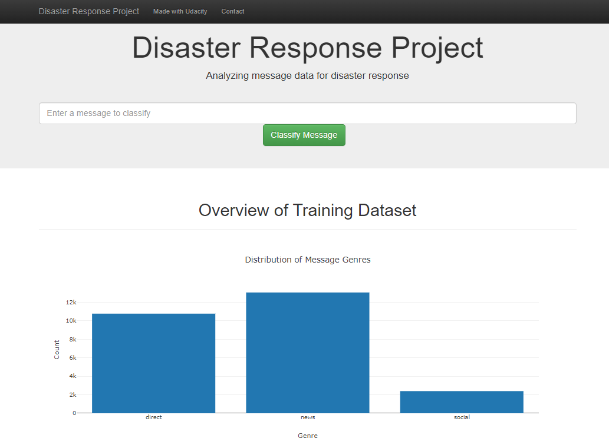
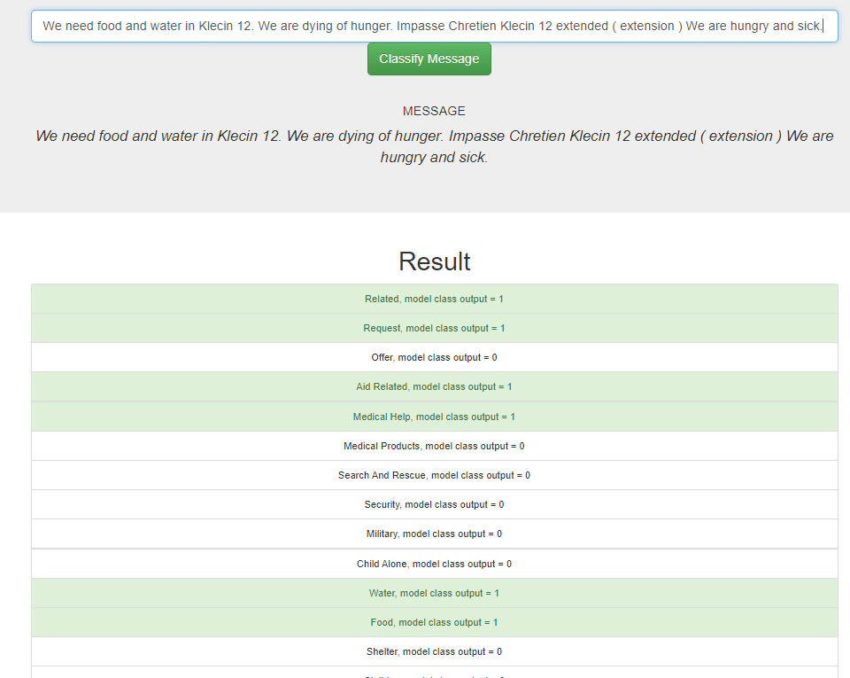
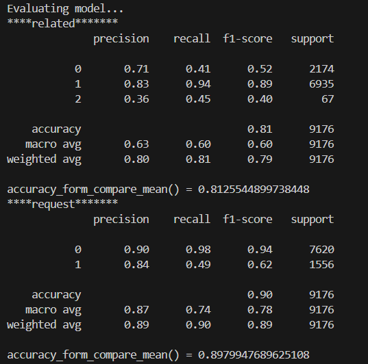
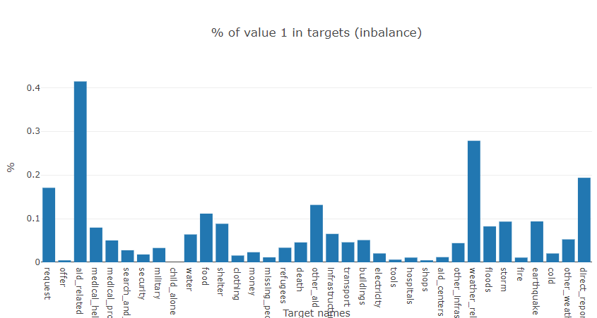

# Disaster Response Pipeline Project

## Project Overview

The objective of this project is to build a machine learning pipeline that classifies disaster-related messages into predefined categories. This will help in directing the appropriate disaster response teams. The dataset, sourced from [Appen](https://www.appen.com/), contains 26,216 real messages and 36 categories related to various disaster situations.

### Pipeline Workflow:

1. **ETL Pipeline (process_data.py)**: Extracts, transforms, and loads the messages into a SQLite database.
2. **ML Pipeline (train_classifier.py)**: Reads data from the database, trains a supervised machine learning model, and saves it as a pickle file.
3. **Web Application (run.py)**: A Flask app displays the data and allows users to classify new messages using the trained model.

## Table of Contents
1. [Project Overview](#project-overview)
2. [Installation](#installation)
3. [File Descriptions](#file-descriptions)
4. [Running Instructions](#running-instructions)
5. [Details](#details)
6. [Model Performance](#model-performance)
7. [Limitations](#limitations)
8. [Future Challenges](#future-challenges)

## Installation

1. Open a terminal and create a project folder:
   ```bash
   mkdir your_project_folder_name
   cd your_project_folder_name
   ```
2. Clone the repository:
   ```bash
   git clone https://github.com/Niltonjuniorphd/DisasterResponseClassifier
   cd DisasterResponseClassifier
   ```
3. Create a virtual environment and install the dependencies:
   ```bash
   # For Linux/Mac
   python3 -m venv .env
   source .env/bin/activate  
   ```

   ```bash
   # For Windows (Recomended)
   python -m venv .env
   .env\Scripts\activate  
   ```

4. Install required packages:
   ```bash
   pip install -r requirements.txt --no-cache-dir
   ```

## File Descriptions

- **app/**: Contains the Flask web app (`run.py` and HTML templates: `go.html`, `master.html`).
- **data/**: Contains the raw data files (`disaster_messages.csv`, `disaster_categories.csv`), the ETL script (`process_data.py`), and the SQLite database (`DisasterResponse.db`).
- **models/**: Contains the machine learning pipeline script (`train_classifier.py`) for training the classifier.

## Running Instructions

Follow these steps to process the data and train the model:

1. **Run ETL Pipeline**: Clean and load data into the SQLite database.
   - Ensure you are in the project directory.
   - Run the ETL script:
   ```bash
   cd data
   python process_data.py disaster_messages.csv disaster_categories.csv DisasterResponse.db
   cd ..
   ```
   - The script will create a SQLite database named `DisasterResponse.db` in the `data/` directory.
   
2. **Run ML Pipeline**: Train the classifier and save the model as a pickle file.
   - Ensure you are in the project directory.
   - Run the ML script:
   ```bash
   cd models
   python train_classifier.py ../data/DisasterResponse.db classifier.pkl
   cd ..
   ```
   - Training may take around 30 seconds.
   - The trained model will be saved as `classifier.pkl` in the `models/` directory.
   - HINT: To bypass GridSearchCV to tune the model and use a preset parameters, modify `train_classifier.py` to call `build_model_GsCV()` instead of `build_model()`. 

3. **Run the Web Application**: Launch the Flask app.
   - Ensure you are in the project directory.
   - Run the Flask app:
   ```bash
   cd app
   python run.py
   ```
   - Access the app at `http://localhost:3001/` (the actual link will be displayed in the terminal).
   - You can input new messages or use the pre-existing messages from the database for classification.
   - The aplication will display the bar graphs to visualize the data properties in the first page:
   -HINT: scroll down to see all the visualizations.



   - After insert the mensage (text) in the text fiel and clik in the green button (or press ENTER), the aplication will display the classification results in a new visualization in the same page:



## Details

- **Python Version**: 3.12.6
- **Main Libraries**: see `requirements.txt`
- The training process utilizes all available CPU cores for parallel processing. 
- The model is a `DecisionTreeClassifier` with `class_weight='balanced'` to handle class imbalance.
- The model is trained on 70% of the data and tested on the remaining 30%.
- The model is saved as a pickle file for future use.
- The web app allows users to input new messages for classification.


## Model Performance

- Model accuracy is evaluated after training and displayed in the terminal. Below is an example for two of the 36 target categories: `related` and `request`.



- Focusing in ´recall' can be the best way to optimize the model, since it inform about the false negatives (FN) predictions. The FN can lead to bad decisions in real-world disaster scenarios. 


## Limitations

- The dataset is imbalanced across categories. This was addressed by using `class_weight='balanced'` in the `DecisionTreeClassifier` to handle the skewed class distribution.




## Future Challenges

- Future work includes incorporating `f1_score` or `recall_score` into `GridSearchCV` for model optimization, as it doesn't natively support these metrics with `MultiOutputClassifier`.
- The model could be further optimized by using `GridSearchCV` to find the best hyperparameters for the `RandomForestClassifier` or `XGBClassifier`.
- The model could be improved by using a more advanced classifier, such as a neural network, to handle the multi-label classification task.

---

This version uses clear, concise language while maintaining technical accuracy for a Data Science audience.