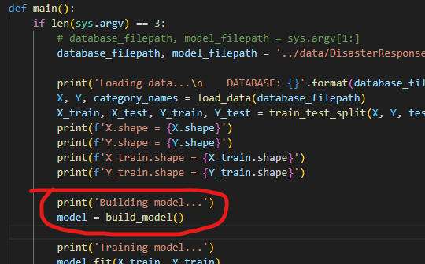

# Disaster Response Pipeline Project

## Project Description

- The goal of this project is to create a machine learning pipeline to classify disaster messages.
- The datasets used in this project are from https://www.appen.com/
- The dataset contains real messages that were sent during disaster events.
- The dataset contains 26,216 messages and 36 categories.

- How it works:
    1. run an ETL pipeline that processes messages and load them into a SQLite database.
    2. then, run a machine learning pipeline to read from the database and create a supervised learning model.
    3. finally, run web app will extract data from this database and use the model to classify new messages.

## Table of Contents
1. [Project Description](#project-description)
2. [Installation](#installation)
3. [File Descriptions](#file-descriptions)
4. [Runing instructions](#runing-instructions)
5. [Details](#details)
6. [Model accuracy](#model-accuracy)
7. [Limitations](#limitations)
8. [Challenges](#challenges)

## Installation
- Open a bash terminal and create a project folder (~/$ mkdir your_project_folder_name)
- Change the directory to the created folder (~/$ cd your_project_folder_name)
- Clone the repository inside the created folder (~/$ git clone https://github.com/Niltonjuniorphd/DisasterResponseClassifier). It will create (clone) a folder called DisasterResponseClassifier.
- Change the directory to the cloned folder created (~/$ cd DisasterResponseClassifier)
- Create a virtual environment to install the Python packages (~/$ python -m venv .env)
- Activate the virtual environment (~/$ source .env/bin/activate) (Warnnig: there are different ways to activate the virtual environment. Recomended: use power-shell in the Vscode will automatic actvate the virtual environment)
- Use requirements.txt file to install the packages (~/$ pip install -r requirements.txt --no-cache-dir)

## File Descriptions
- the folder called app contains the Flask web app files (run.py, templates/go.html and master.html).
- the folder called data contains the data files (disaster_messages.csv, disaster_categories.csv and process_data.py). The sql file is a query to check the database (after it was created).
- the folder called models contains the pipeline to train/test machine learning model (train_classifier.py).

## Runing Instructions:
1. if you do NOT want create the database and train the model again, running the app using the existing model cloned from the git repository, just go to run the APP:
    - WARNING: The training step requires a lot of time to complete!

1. if you want load data (ETL) and train a new model, run the following commands in the project's root directory to set up your database and model:
    
    #### ==> Remember to see the terminal logs during each execution to get more informations.
    
    - To run ETL pipeline that cleans data and create/stores in database : 
        - move to data folder: (~/$ cd data)
        - execute: (~/$ python process_data.py disaster_messages.csv disaster_categories.csv DisasterResponse.db)
        - return to root folder: (~/$ cd ..)

    - To run ML pipeline that trains classifier and saves a Pickle binary file:
        - move to models folder: (~/$ cd models)
        - execute: (~/$ python train_classifier.py ../data/DisasterResponse.db classifier.pkl)
        - return to root folder: (~/$ cd ..)
        - you can swich from RandomForestClassifier to SVC model (a support vector machine calssifier) just changing from build_model() to  build_model_SVC() function in the main() function of the train_classifier.py file.
        
        

    - to run the APP:
        - move to app folder: (~/$ cd app)
        - execute: (~/$ python run.py)
        - Go to http://0.0.0.0:3001/ (or see the link/path in the terminal)
        - you can tipe a disaster mensage or copy a mensage from database (using the query.sql file) and pass a message to the app. The app will predict the category of the message and show the results (green color = category 1).
        
        
    

## Details
- The project was developed using Python 3.8.10, Flask 2.0.2, Numpy 1.21.2, Pandas 1.3.4, Scikit-learn 1.0.2, SQLAlchemy 1.4.30, Pickle 4.0.1, and Plotly 5.7.0.
- The project was developed using a Windows 10 64-bit operating system.
- The train step requere a lot of time to be completed! It has a paralel job seted to '-1' to use all the cores of the computer been used. Time reuction could be done by changing the 'features' created during the pipeline executions.

## Model accuracy
- The accuracy of the model is evaluated and displayed in the terminal after the training step. Bellow is the exemple for the result of the fist and second of the 36 target evaluation 'related' and 'request':

#### Please, see an exemple in the file 'model_accuracy_terminal_log.txt' in the folder called 'models'.

## Limitations
- There are imbalances in the target in the dataset, but it was not treated in this project. 

## Challenges
- A future challenge is use f1_score or recall_score in the gridsearch with MultiOutputClassifier to evaluate the best model, since the GridSearchCV do not directly accept the f1_score or recall_score as a metric when using MultiOutputClassifier.
- Another challenge is reduce the time to train model. Maybe a better solution is to use a GPU to train the model or reduce the dimensionality of the train dataset using PCA.